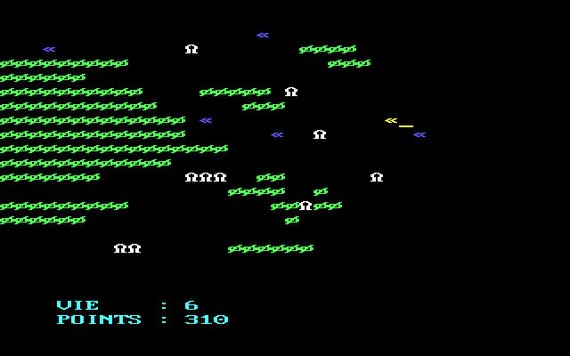

Old Turbo Pascal programs
=========================

Those are programs that I wrote while I was a kid.

It is a bit difficult to know the exact dates because most files are
dated from 1990 or 1991 but I remember that most of them were
programmed on an [Olivetti Prodest PC1][] with a CGA onboard display
chipset. Some programs were developed on Turbo Pascal 4. some others
on Turbo Pascal 5. So, they should date from 1988 to 1991.

I retrieved them from 720k floppy disks which were still readable
today (2014) using a cheap USB floppy drive.

[Olivetti Prodest PC1]: http://www.seasip.info/VintagePC/prodestpc1.html

Use
---

Each directory contains a program. I also provide the appropriate
version of Turbo Pascal 5.5 in `TP/`. This is by no mean legal, but I
don't think anyone will care (also, it seems Borland [released it for
free][] in 2002). The best way to use all that is [DOSBox][]. The
compiled executables are also provided since they are small and allow
one to quickly test a program without compiling it.

[DOSBox]: http://www.dosbox.com/
[released it for free]: http://www.doshaven.eu/programming-tools/

Programs
--------

 - `castle/`: an unfinished castle adventure (see the screenshot below).
 - `diamant/`: an unfinished reimplementation of [Boulder Dash][].
 - `fantome/`: an illustrated adventure game, a la Zork.
 - `geo/`: a program to learn major French cities.
 - `manoir/`: a point and click adventure game in an haunted mansion (see the screenshot below).
 - `manoir2/`: the sequel to the previous game.
 - `martiens/`: a game where you need to prevent an ET to land.
 - `morse/`: translate keys to morse code.
 - `paint3/`: a drawing program. It has been used to draw other
   graphics as it can export pictures directly in Pascal code.
 - `resist/`: a program to train to read resistor values using the
   appropriate color codes.
 - `space/`: a game where you need to fly through screen without
   colliding with other objects (see the screenshot below).
 - `thedraw/`: a drawing program. The menu can be displayed with a
   right-click.
 - `think/`: some game but I didn't remember the purpose. Cool
   graphics!
 - `water-po/`: a water polo game.

[Boulder Dash]: http://en.wikipedia.org/wiki/Boulder_Dash

Here are a few screenshots:

